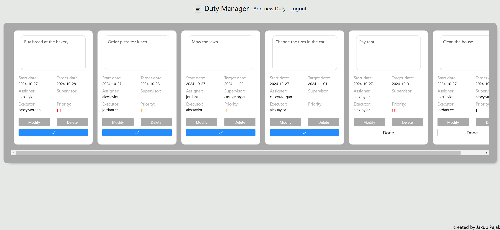
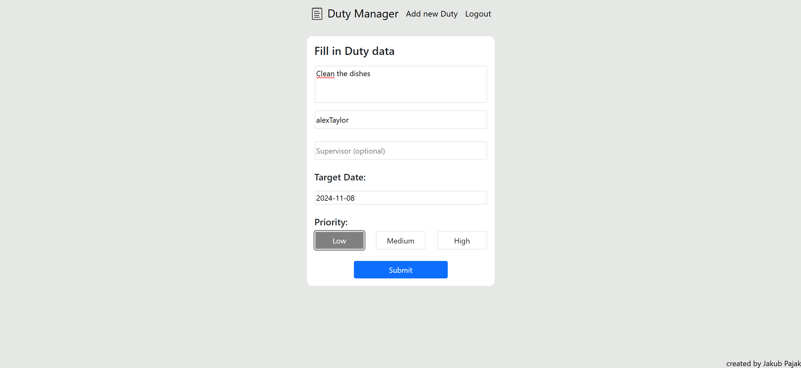

# DutyManager

DutyManager is a web application designed to streamline duty management for users. It provides an intuitive interface for updating, deleting, and completing duties, ensuring efficient task management. The application is built using Spring Boot for the backend and utilizes JSP for the front end.

It was created to learn and practice building a simple web application with Spring Boot and PostgreSQL.

## Table of Contents

- [Key Features](#key-features)
- [Technologies](#technologies)
- [Site](#site)
- [Setup](#setup)
- [Running the Application](#running-the-application)
- [Needed impovements](#needed-improvements)
- [Contributing](#contributing)
- [License](#license)

## Key Features

- Users can view, update, delete, and mark duties as finished through a user-friendly JSP interface.
- Secure login  using Spring Security with an InMemoryUserDetailsManager.
- Dockerized PostgreSQL setup for easy database management.


## Technologies

### Backend  
- **Backend Framework**: Spring Boot (Version 3.3.5)  
- **Web Framework**: Spring MVC with JSP (JavaServer Pages) for the front end  
- **Data Persistence**: Spring Data JPA with PostgreSQL
- **Containerization**: Docker for containerizing the application and managing dependencies
- **Security**: Spring Security for user authentication
- **Validation**: Hibernate Validator through Spring Boot Starter Validation  
- **Dependency Management**: Maven for project management and dependencies  

### Frontend:  
- Bootstrap for responsive design
- jQuery for DOM manipulation
- Font Awesome for iconography
- Bootstrap Datepicker for date selection

## Site
#### Duties Management Page


#### Duties Creation Page


## Setup

**Prerequisites**
- Java 17 or later
- Maven
- Docker

1. **Clone the repository**
   ```bash
   git clone https://github.com/yourusername/DutyManager.git
   cd DutyManager
   ```

2. **Configure the Database**  
   The application uses PostgreSQL as the primary database. Configuration details are set in the application.properties file.

3. **Run Docker Compose**  
   Use docker-compose.yml to set up the PostgreSQL container. To start the database: 
   ```bash
   docker compose-up
   ```

4. **Build and Run the Application**
   ```bash
   ./mvnw spring-boot:run
   ```

## Running the Application  
Once the application is running, the API will be available at http://localhost:8080.

## Needed Improvements
- Service Layer Implementation: Introduce a service layer to decouple the DutyController from the repository, enhancing code modularity and maintainability. This will facilitate easier testing and better separation of concerns.

- User Registration Functionality: Develop the necessary entities, controllers, services, and repositories to implement user registration. This will allow for a more comprehensive user management system within the application.

- Registration Page Development: Create a user-friendly registration page that enables users to register easily. The page should include input validation and feedback mechanisms to enhance the user experience.

- Comprehensive Testing: Implement thorough testing strategies to ensure the reliability and functionality of the application.

## Contributing

Pull requests are welcome. For major changes, please open an issue first
to discuss what you would like to change.

Please make sure to update tests as appropriate.

## License

[MIT](https://choosealicense.com/licenses/mit/)
